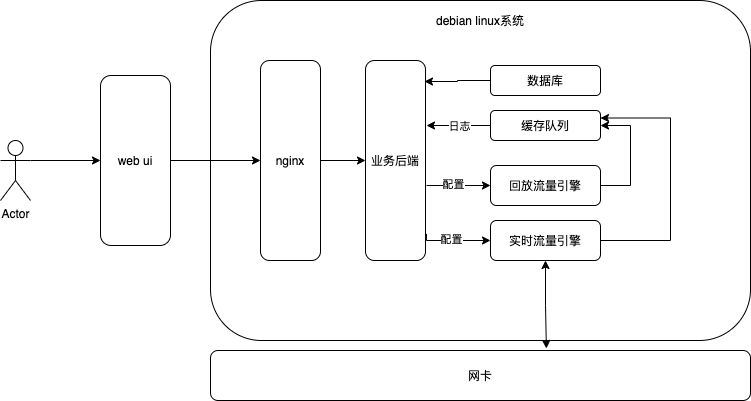
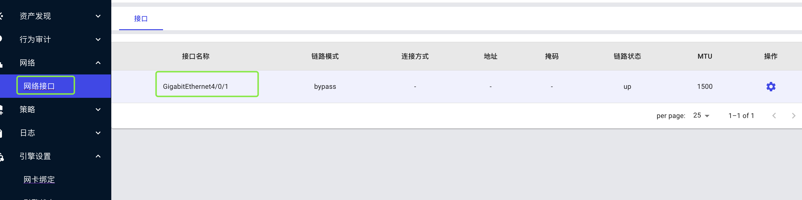

# xsnos简介
xsnos(security & network operator system), 定位为一款网络与安全相关的操作系统，类似kali一类的操作系统，但是是以提供流量监控、转发控制为主，其他工具为辅的整套操作系统，并提供基本的ui操作，使得用户通过web界面观察系统运行结果。xsnos基于debian进行部署，将前端、后端以及引擎打包到一起进行部署安装、协同工作。

# 架构图

如图所示，xsnos包含前端ui、后端服务以及双引擎(回放流量引擎、以及实时流量引擎)。其中ui负责与用户交互，采用react/material-ui进行开发；后端服务负责交互业务逻辑处理，采用go/gin进行开发；引擎负责处理回放pcap包以及实时网卡流量，采用c/dpdk进行开发。

# 关于引擎(重要)
系统在初次安装后，引擎是默认是不启动的，需要用户在系统导航栏-引擎设置-引擎状态处对引擎进行启动、关闭操作。

回放流量引擎是通过上传pcap数据包来处理流量的，pcap数据包可以在引擎设置-pcap管理处上传。

实时流量引擎是监控网卡流量的，所以依赖网卡，需要对网卡进行网卡绑定(为什么需要绑定，可以查看dpdk相关资料)，才能够启动成功。关于如何绑定网卡，请查看下面说明。

# 关于DPDK与网卡绑定
DPDK（Data Plane Develop Kit）数据平面开发工具包，是Intel开发的用于网络数据包加速的开发套件。 它将传统的网卡收到数据包通过内核态处理的流程转移到了用户态处理，减少了CPU处理中断和上下文切换额开销，能够使CPU得到更高效的利用。

我们将网卡从内核态转移到DPDK用户态的过程叫绑定网卡，把网卡从DPDK用户态再归还给内核态的过程叫解绑网卡。而实时流量引擎依赖DPDK，所以在实时流量引擎启动前，必须先绑定网卡。

# 关于网络接口(重要)
xsnos一般用于多网卡环境，在网卡绑定之前，我们可以指定一个接口作为管理口(非必需，但建议指定)。被指定为管理口的网络接口，可以配置本机的网络地址信息，并且将不会再绑定网卡页面出现，该功能在导航栏系统-管理接口进行设置。

除管理接口之外，其他的网络接口，都会出现在引擎设置-网卡绑定页面。绑定某个网卡接口，就意味着把网卡接口从内核处理流程转移到了DPDK处理流程，实时流量引擎启动后，就会发现该网卡接口并从该网卡接口中读取网络流量进行处理。实时流量引擎启动后，也会将网卡接口进行编号，我们经常称绑定后的接口为数据平面接口，这些接口是在导航栏网络-网络接口处查看。如图

# 关于被动资产测绘
被动资产测绘功能默认是关闭的，如需该功能，需要在导航栏资产发现-设置处进行设置。

默认情况下，资产发现只统计内网ip，如需统计外网ip，需要取消勾选资产子网限制。

被动资产测绘同时支持pcap包回放，以及实时流量监控。

# 关于行为审计
行为审计又包含流审计以及安全审计。

流审计：主要记录网络当中的会话流(流审计包含5元组信息、应用层协议、请求回应流量等)、以及各种协议详细信息(HTTP协议信息、DNS协议信息、TLS协议信息等)

安全审计：安全审计主要包含一些安全日志信息
