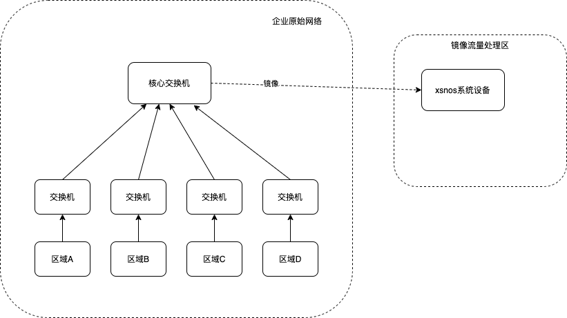

# 关于xsnos
xsnos, 一款网络与安全相关的操作系统，最终目标是类似kali一类的操作系统，但是是以提供流量监控、转发控制为主，其他工具为辅的整套操作系统，并提供基本的ui操作，以使新手快速上手。目前还处于起步阶段，将来会不断的加入各种各样的网络与安全的功能，详情请看[用户使用手册](./manual.md)。

# 如何安装
请参考[安装手册](./install.md)

# 架构图

如图所示，xsnos包含前端ui、后端服务以及双引擎(回放流量引擎、以及实时流量引擎)。其中ui负责与用户交互，采用react/material-ui进行开发；后端服务负责交互业务逻辑处理，采用go/gin进行开发；引擎负责处理回放pcap包以及实时网卡流量，采用c/dpdk进行开发。

# 部署图

# 使用限制
xsnos对于自用是免费的，并将一直免费下去。

# 以后是否会开源
该版本暂时应该是不会开源的，但是未来我想肯定是有一个开源版本，主要是供学生学习使用，功能不会很完善。

# 注意事项
如果之前未接触过DPDK，一定要认真阅读[安装手册](./install.md)和[使用手册](./manual.md)，了解相关机制后再使用，乱绑定网卡可能会导致网络不可用。

# 讨论群
请加管理员微信，注明加xsnos讨论群

